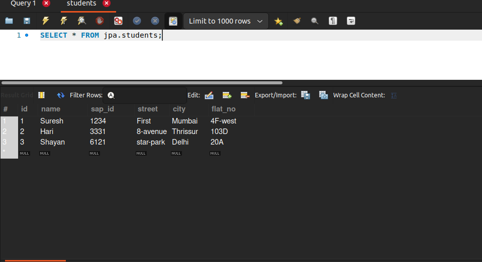
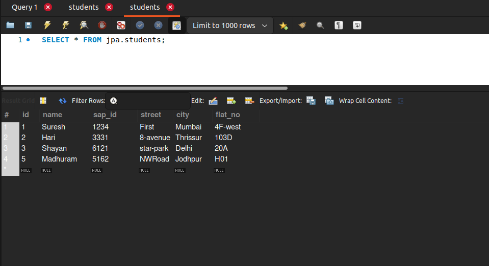
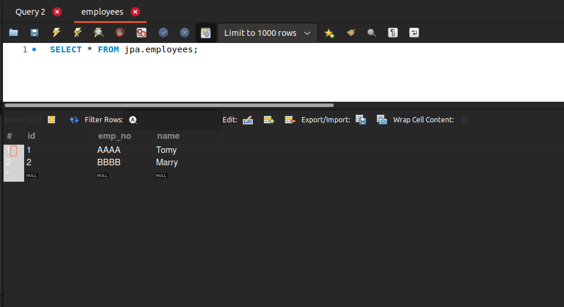

# attribute-overrides
In this example I have taken Student as an Entity and Address to be
the embeddable type, which consists of street, flat-number and city.
As we know that embeddable types have a separate responsibility and they
are not entities, they can be embedded into entities and to make code
design-good and code less, as in future let's say i have to add another entity
Faculty, then in faculty address i can also embed address.

But in Address type, i have not given the name of the column same as my
database name, we know that we can do it using column annotation, but i have not marked
anything on that field.
Now hibernate will not be able to get the name and throw an exception
that _**'Unknown item in list'**_.Now the solution to this is that when declare the 
Address type then mark it with **AttributeOverride** annotation. and specify the **_name_** which we have given 
in java class to that field and in column field give mark it with **_@Column(name = "actual_name")_**.

We can use **AttributeOverrides annotation** and instead of writing annotation
for every attribute, in case we have many of couple of them, then use this as an
array of AttributeOverride and we have only one Annotation all together.

# Composed Primary Keys
If we have more than one primary key in our table so in
order to do it in hibernate:

1. In this example I have a table employee with two primary keys
    id and emp_no, according to JPA specification we will have to
    create Entity and Table as regular and mark the fields with PK as Id
    Now create other class that has the exact same fields as that of PK in 
   Entity and should implement Serializable Marker Interface.
   In Entity class use IdClass annotation, and it takes the class which represents the Composed primary key.
   
  We have to create separate table for representation of composed primary key.
  
  