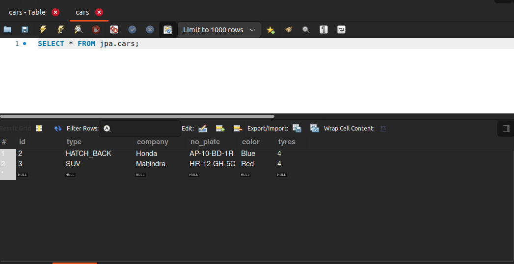

# embedded-types
In order to write code in our java class cleaner and 
mainly separating the classes that can later be re-used in 
other classes.

In this example i have used cars table and stored basic details of
cars as type, and as we see other attributes of car like
company, number plate, colour and tyres are general properties of not
only car but of vehicle.
In hibernate we have to specify the table  attributes that we
want to be in a class and mark that class with **_Embeddable_** annotation
so that hibernate understands that this is embeddable type and then
in the Entity which we want the attributes, just add the field in java class
and **_mark it with embedded_** annotation. It will automatically map them according to their name.

