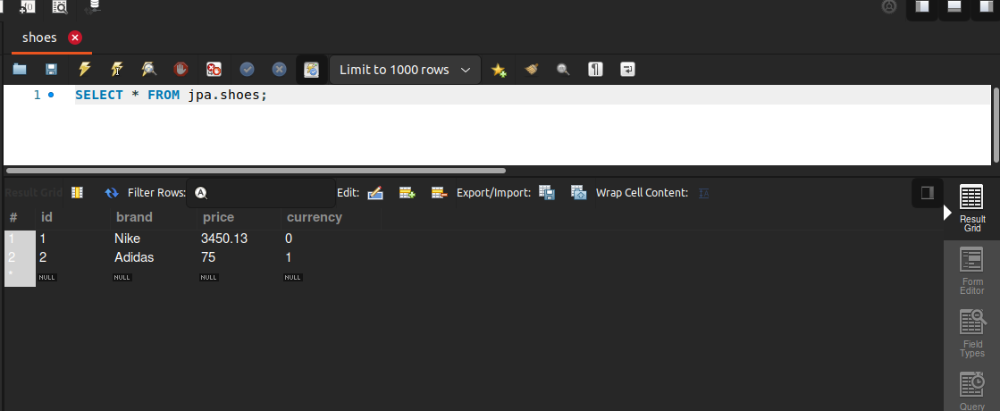
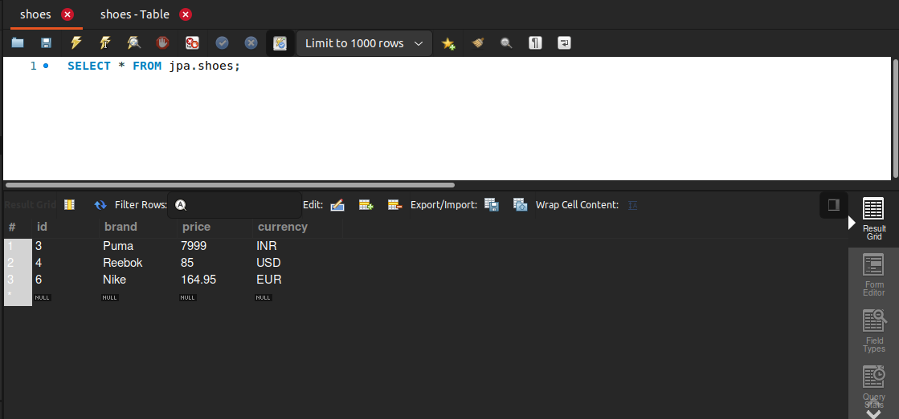

# enumerated-types
In this module i have used the enumerated annotation
as sometimes in the entity we may have to store certain types
and we can do it with help of _**Enums**_ 
in java, but in in order to understand it by mysql we have to 
use Enumerated Annotation and specify the value, by defaut it is ordinal
and other option is String.

### enumerated-type-ordinal
If we specify the value to be ordinal then in the mysql table it will use no.s 
to identity the types, in this example i have used shoe entity and to store the currency
of shoes, there are two types Indian Rupees and U.S. Dollars, for INR it will use 0 and for USD it will use 1.
No. is used for the type.

### enumerated-type-string
In this case if we changed the value to string then mysql will 
take the name of the type which is specified in Enum, so 
here in Currency i have added one more type EUR and when i persist
the entities, then in table it will store the name of type as string

**_Also the type of currency attribute is changed to VARCHAR so that we can
because we are storing String as the type and not INT._**

