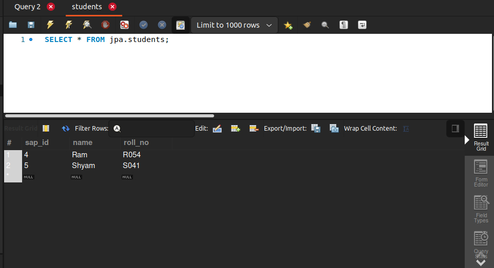
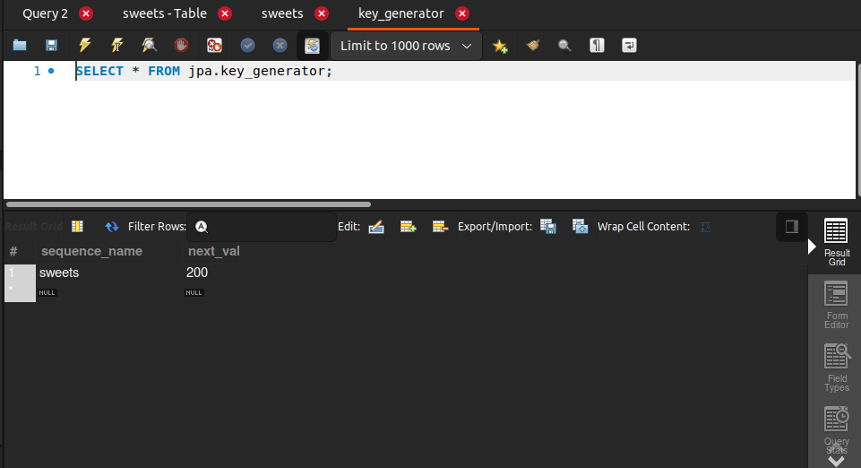
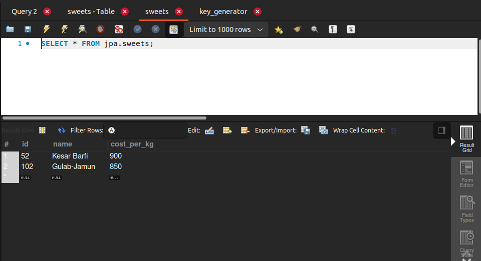

# ids-and-values
In this project I have created a simple student database and implementing
the Id's using GeneratedValue Annotation, Hibernate helps us 
to generate the id's or primary keys of database using certain strategies:

    1. Generation_TYPE.IDENTITY: It enables the AUTO INCREMENT and every time we insert values, hibernate will 
                                  use AUTO INCREMENT and id will be set according to that strategy.

    Example Screenshot: 
    

    2. Generation_TYPE.TABLE: It uses another table to store the sequence and the
                              next value of the id, so here AUTO INCREMENT is not there we have
                              to turn it off, in this strategy.

    Example Screenshot:

Sequence/ID Generator Table: Which is storing the sequence name sweets and next value which will be 
for next entity when added

Sweet Table:

