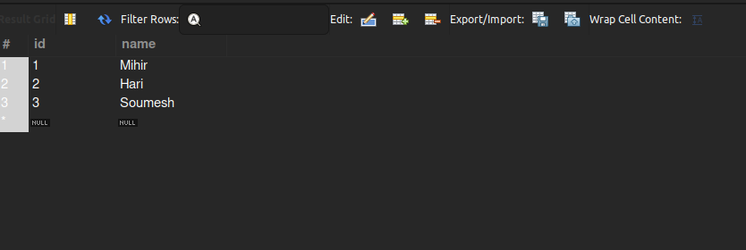
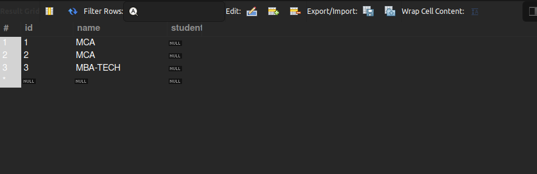

# One-To-One Relationship
While Designing databases we usually store related data together
and in between two tables then we have certain relationship 
to relate data and while time of fetching we can combine it later using Joins

We here have a one-to-one relationship between two tables, which means
that one row in a table maps to only one row in other table, It maps its Primary Key
to other table which will then refer that which row was referenced from that table.

Like in this example i have Student and Course table, As one student is allowed
to only enroll in one course the relationship between two is One-To-One, i.e.
one student is only enrolled in one course so one row in student table maps to corresponding
one row in courses table.

In hibernate there are two ways:
1. **Secondary Tables:** We create our Entity and all the fields and
    then also add the fields of other table and then use _@Column_ annotation
    and specify the table name using table attribute and then 
    on top mark the class with **@SecondaryTable(name = "tableName")** and mention the other table name
    which you would like to map relationship with,
    hibernate will use the PK Id to map to the Id of other table.
    
   But the issue is that in my courses table i have mentioned the student column
   where i wanted the id of student to be referenced, but as hibernate is unaware about it
   then it will only use id and the student column remains _NULL_.

**Student Table:**

**Courses Table:**

